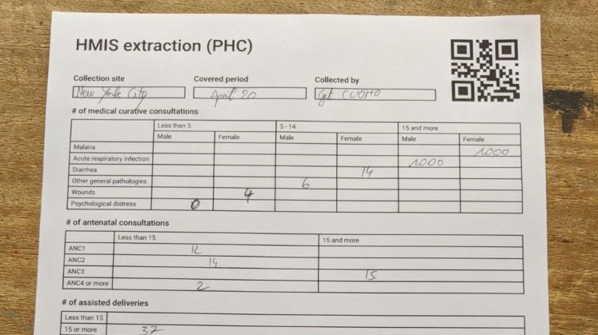
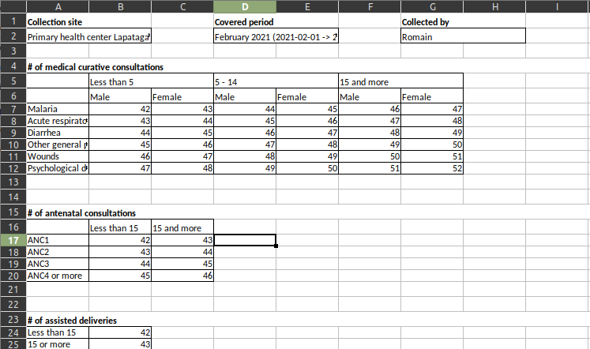

# Tallysheet Time Machine


Tallysheet Time Machine brings back paper and Excel tallysheets from the past with some improvements!

It is a set of NodeJS library which enables generation and parsing/image recognition/OCR of paper and Excel tally sheets.




# Rationale behind the project

Tallysheet Time Machine was written as a companion library for [Monitool](https://github.com/romain-gilliotte/monitool), a full-featured open-source monitoring platform targeted at humanitarian organizations.

By reducing the amount of work needed to perform computer-less data collection, it aims to make the process easier on situations where online/offline form builders cannot be used, and paper and Excel are the only ways.

Other projects:
- None known
- ... PR to add yours!

# Milestones

Besides the OCR, which is not supported (only regions are extracted from Paper), Tallysheet Time Machine is already in production.

However, it was actually build as a module in Monitool, and needs to be extracted from the main repo: this library is a complete work in progress.

- [x] Extract page from background image, reproject it, and crop it to get question data. 
- [x] Write README
- [x] Design public API as doc in the README
- [x] Move code from monitool as-is
- [ ] Remove dependencies to other Monitool code
- [ ] Port code to TypeScript
- [ ] Split into multiple packages (main, zip, xlsx, paper, ...)
- [ ] Make everything work again
- [ ] Write proper tests / improve testing dataset
- [ ] Use Mturk or similar to implement OCR feature
- [ ] Use dataset to generate proper OCR

# Installation

The module runs only in NodeJS as it depends on native NodeJS libraries.

Install only the modules you really need! 

This is specially true if you don't need the paper form support which depends on `opencv`. It will pull several hundred MB of files on your `node_packages` folder.

```console
$ npm install tallysheet-timemachine
$ npm install tallysheet-timemachine-excel  # Excel support
$ npm install tallysheet-timemachine-paper  # Paper support
$ npm install tallysheet-timemachine-zip    # Zip file unpacking
$ npm install tallysheet-timemachine-pdf    # PDF file unpacking
```

Typescript autocompletion is supported. Once installed, the main class is available as the index of the package.

```javascript
import TallySheet from 'tallysheet-timemachine';      // ES6+
const TallySheet = require('tallysheet-timemachine'); // CommonJS
```

# Usage

## Form creation

Forms are created with the `TallySheet` class.
Convenience methods are available to add questions, disagregations and elements.

```javascript
const questionList = new QuestionList('123');
questionList.addSite('1', 'Paris');
questionList.addQuestion('1', 'Number of consultations');
questionList.addDisagregation('1', '1', 'Age');
questionList.addDisagregationElement('1', '1', '1', 'Under 12');
questionList.addDisagregationElement('1', '1', '2', '12 and more');

// Will generate the following tally sheet:
//                             ____________________
// Number of consultations    | Under 12 | Over 12 |
//                            |____xx____|____xx___|
```

They can also be imported from a POJO object

```javascript
const questionList = QuestionList.fromObject({
    id: '1',
    sites: [{ id: '1', name: 'Paris' }],
    questions: [
        {
            id: '1',
            name: 'Number of consultations'
            disagregations: [
                {
                    id: '1',
                    name: 'Age'
                    elements: [{id: '1', name: 'Under 12'}, { id: '2', name: '12 and more'}]
                }
            ]
        }
    ]
})
```

## File Generation

Once a `QuestionList` is created, multiple `Form` can be derived, for each file format and option.

```javascript
// Create template
const form = new PaperForm(questionList, { orientation: 'portrait', language: 'fr' });
// [or] new PaperForm(questionList, { orientation: 'landscape', language: 'en' });
// [or] new ExcelForm(questionList, { language: 'en' });
// [or] ...

fs.writeFileSync('form.pdf', await form.render());
```

The `Form` instances contain metadata: they must be serialized and kept to be able to perform later image recognition/parsing once the form is filled.

```javascript
const metadata = JSON.stringify(form.toObject());
fs.writeFileSync(`formMetadata-${form.id}.json`, metadata);
```

## Parsing / Image recognition

```javascript
const extractor = new FormExtractor(
    // Loaded plugins
    [new PdfFormExtractor(), new ImageFormExtractor(), new XlsxFormExtractor(), new ZipFormExtractor()],

    // Form loader (you are responsible for storing the form between generation and data extraction)
    templateId => {
        const templateFile = fs.readFileSync(`formMetadata-${page.templateId}.json`);
        const template = PaperFormTemplate.fromObject(JSON.parse(templateFile));
        return template;
    }
)

// Load file and search forms inside it.
const zip = fs.readFileSync('./stackOfFormsPhotosAndExcel.zip');

for await (let formData of extractor.process(zip)) {
    // The identifier of the template and the page number are stored in the form
    // (either in the QR-code or in hidden data in the Excel files).
    formData.type;     // "paper" or "excel"
    formData.form;     // Reference to the form, which helps us perform the OCR.
    formData.pageNo;   // Always 1 for Excel, can be any number for multipage paper forms.

    // Access a reprojected image (only for paperforms) or the data directly (only for excel).
    formData.getImage(); // => Buffer containing the reprojected image.
    formData.getData();  // => { [questionId]: [1, 2, 3, 4, ...] }
    
    // We can also iterate questions
    for (let variable of formData.getVariables()) {
        // Get the boundaries of the corresponding variable data.
        formData.getVariableBoundaries(variable.id);

        // Same as getImage() and getData() for a given variable.
        formData.getVariableImage(variable.id); // Get a cropped image of the variable data
        formData.getVariableData(variable.id);  // Get the actual data
    }
}
```
